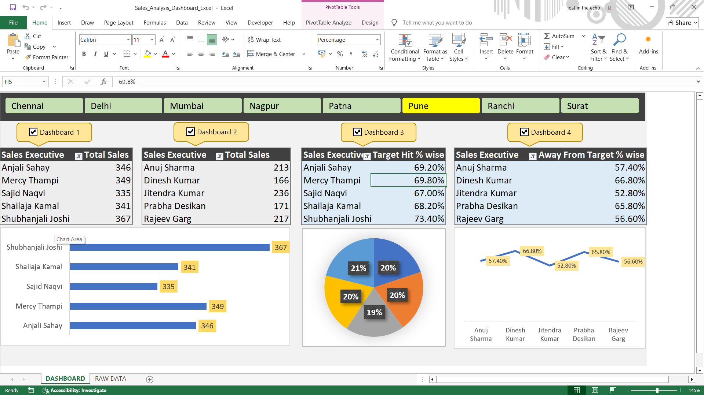

# 📊 Excel Sales Dashboard Project

## 📌 Overview
This project is an interactive sales performance dashboard built using Microsoft Excel.

The dashboard analyzes sales executive performance across multiple cities and tracks metrics such as:

• Total Sales
• Target Hit Percentage
• Away From Target Percentage
• Sales Executive Performance Comparison

## 🛠 Tools Used
- Microsoft Excel
- Pivot Tables
- Charts
- VBA Macros

## 📈 Features
- Interactive city-based dashboard
- Automated dashboard switching using VBA
- Dynamic charts for performance analysis
- Executive-wise sales tracking

## 📷 Dashboard Preview

## 📂 Dataset
The raw data used for this dashboard is stored in the **RAW_DATA** sheet.

## 🚀 Learning Outcome
Through this project I practiced:

- Excel Dashboard Design
- Data Visualization
- Pivot Table Analysis
- VBA-based automation
# 📊 Excel Sales Dashboard Project

## 📌 Overview
This project is an interactive sales performance dashboard built using Microsoft Excel.

The dashboard analyzes sales executive performance across multiple cities and tracks metrics such as:

• Total Sales
• Target Hit Percentage
• Away From Target Percentage
• Sales Executive Performance Comparison

## 🛠 Tools Used
- Microsoft Excel
- Pivot Tables
- Charts
- VBA Macros

## 📈 Features
- Interactive city-based dashboard
- Automated dashboard switching using VBA
- Dynamic charts for performance analysis
- Executive-wise sales tracking

## 📷 Dashboard Preview

## 📂 Dataset
The raw data used for this dashboard is stored in the **RAW_DATA** sheet.

## 🚀 Learning Outcome
Through this project I practiced:

- Excel Dashboard Design
- Data Visualization
- Pivot Table Analysis
- VBA-based automation
